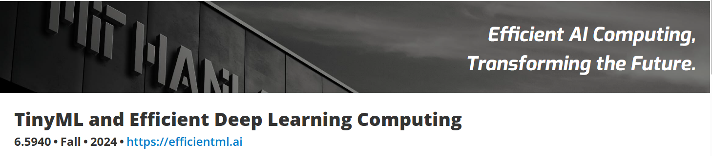

The TinyML course by Song Han at MIT 6.5940: Efficient Machine Learning was the best resource that I could find for learning about TinyML. I really enjoyed the course and learned a lot about the basics of TinyML.

This repo contains my attempts at the labs for the course.

All material belongs to their respective owners at the HAN Lab at MIT.